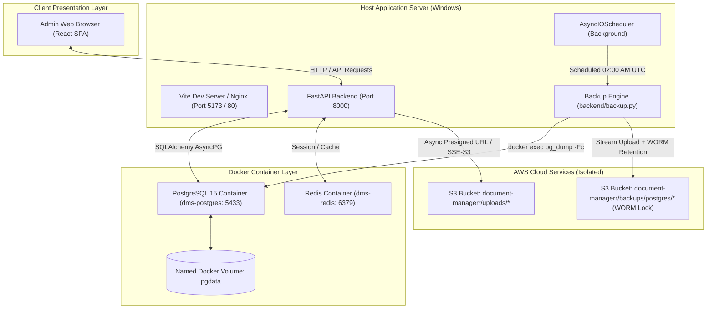

# Architectural Overview: Document Management System (DMS)

This document describes the high-level architecture, data layers, security boundaries, and cloud storage patterns of the Document Management System.

---

## 🏛️ System Architecture Diagram

---

## 🧩 Core Architectural Components

### 1. Presentation Layer (Frontend SPA)
* **Technology:** React 18, Vite, Tailwind CSS, Lucide Icons, Framer Motion.
* **Single Tenant Admin Flow:** Default landing page is the administrative authentication screen. All customer-facing self-service portals and pricing estimators have been streamlined out.
* **Persistent Alert Banner:** Unacknowledged backup failures and disk space warnings are permanently pinned at the top of the interface until an administrator explicitly acknowledges them.
* **Settings & Backup Console:** Provides a dedicated management view to adjust operational settings, review storage logs, monitor host disk usage, and trigger manual S3 snapshots.

### 2. Backend API Layer (FastAPI)
* **Framework:** FastAPI with asynchronous ASGI execution (`uvicorn`).
* **File Watcher Scoping:** Uvicorn is strictly scoped to `--reload-dir backend` in development so changes in `myenv/` or `frontend/` never disrupt runtime stability.
* **S3 Client Lifecycle:** Reuses module-level async `aioboto3` client singletons registered in FastAPI startup/shutdown lifecycles, avoiding client thrashing in API loops.
* **Rate Limiting:** Managed via `slowapi` with in-memory or Redis key tracking.

### 3. Database & Caching Layer
* **PostgreSQL:** Runs inside Docker (`postgres:15-alpine`), mapped to host port **`5433`** to avoid conflicts with native Windows PostgreSQL services running on port `5432`.
* **Primary Key & Schema:** `users` table keyed by `vehicle_reg_no`. Document versions are indexed by `(vehicle_reg_no, doc_type, version_number)`.
* **Migrations:** Managed with **Alembic**. Current migration revision: `e8870016ae16` (cleaned schema with `system_alerts`, `storage_logs`, `system_settings`, and legacy `otp_store` dropped).
* **Redis:** Runs in Docker (`redis:alpine`) on port `6379` for caching administrative search aggregations and statistics.

### 4. Cloud Storage & Backup Architecture
* **S3 Isolate:** AWS S3 is the sole cloud service. All other AWS dependencies (SNS, SES, RDS, CloudWatch) have been eliminated.
* **Document Uploads:** Streamed to S3 with SHA-256 deduplication and SSE-S3 (AES-256) server-side encryption.
* **Automated Database Backups:** APScheduler triggers daily snapshots directly from the PostgreSQL Docker container, uploads to `backups/postgres/`, and enforces WORM retention via S3 Object Lock.
