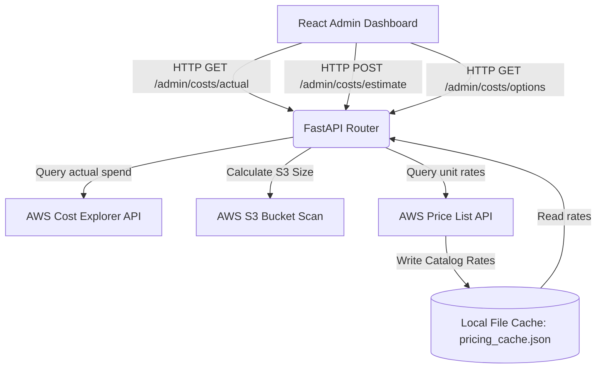

# AWS Cost Management & Estimator — Architecture & Integration

This document details the design decisions, caching strategies, and API specifications for the **Pricing & Costs** administration system.

---

## 1. Overview & Objectives
The admin pricing portal serves a dual operational purpose:
1. **Actual Billing Audit**: Track month-to-date AWS billing expenditures (S3 and RDS) and project month-end totals to identify run-rate anomalies.
2. **Deployment Scale Estimator**: Simulate resource upgrades and estimate monthly compute/storage charges (including hypothetical EC2 instances) to assist in the EC2 deployment go/no-go decision.

---

## 2. Architectural Flow
The cost management component utilizes both live AWS resource scans and the AWS Pricing APIs.



---

## 3. AWS API Integrations

### A. AWS Cost Explorer API (`ce` client)
- **Purpose**: Retrieves month-to-date billing metrics grouped by service.
- **Region Constraint**: Cost Explorer is a global billing API. The client is initialized in `us-east-1` (the default AWS billing registry endpoint).
- **Extrapolation Math**:
  To compute the predicted month-end expenditure, we calculate a linear run-rate extrapolation:
  \[
  \text{projected\_cost} = \left(\frac{\text{total\_actual\_cost}}{\text{days\_elapsed}}\right) \times \text{total\_days\_in\_month}
  \]
  *Note: To align with the Cost Explorer's 24-hour processing delay, `days_elapsed` reflects yesterday's date relative to the first day of the billing period.*

### B. AWS Price List API (`pricing` client)
- **Purpose**: Dynamically pulls live catalog rates for AWS infrastructure.
- **Client Configuration**: Initialized exclusively in `us-east-1` (the Price List service endpoint).
- **Location Mapping**: The Price List API requires location names (e.g., `Asia Pacific (Mumbai)`) instead of standard region codes (e.g., `ap-south-1`). We map the system's `AWS_REGION` configuration through a local region-to-location mapper.
- **Filters**:
  - **S3 Standard Storage**: `volumeType = Standard`, `productFamily = Storage`.
  - **RDS PostgreSQL Storage**: `volumeType = General Purpose`, `productFamily = Database Storage`.
  - **RDS Instance Types**: `instanceType = [db.t3.micro|small|medium]`, `databaseEngine = PostgreSQL`, `deploymentOption = Single-AZ`.
  - **EC2 Instance Types**: `instanceType = [t3.micro|small|medium]`, `operatingSystem = Linux`, `tenancy = Shared`, `preInstalledSw = NA`, `capacityStatus = Used`.

---

## 4. Caching & Performance Optimizations
The Price List API payload is extremely large (often several megabytes) and slow to return. Querying it on every client request would result in severe request timeouts and trigger AWS API throttling.

- **Weekly Cache**: Rates are stored locally in the container's filesystem at `/app/backend/pricing_cache.json` alongside a fetch timestamp.
- **Non-Blocking Background Refresh**:
  When a request is received, the app verifies the cache age. If it is older than **7 days**, the existing cached rates are returned immediately to keep the API fast, while a background thread is spawned using FastAPI's `BackgroundTasks` to fetch fresh rates from the AWS Pricing API and update the cache file.

---

## 5. Development Mode & API Fallbacks
In offline, local development, or when AWS credentials are not configured:
- **Cost Explorer Fallback**: Defaults S3 actual cost to `$0.45` and RDS database actual cost to `$8.20`.
- **Price List Fallback**: Defaults S3 storage rate to `$0.023/GB`, RDS storage to `$0.115/GB`, and standard hourly instance rates.
- **Dynamic Calculation**: The Estimator continues to compute dynamic costs using these fallback rates, ensuring the admin interface remains fully interactive.

---

## 6. API Endpoints Reference

### 1. `GET /admin/costs/actual`
Returns month-to-date S3 and RDS spend and extrapolated month-end projections.
- **Response Shape**:
  ```json
  {
    "period": "2026-06-01 to 2026-06-20",
    "services": {
      "s3": { "actual_cost": 0.45 },
      "rds": { "actual_cost": 8.20 }
    },
    "total_actual": 8.65,
    "projected_month_end": 14.42
  }
  ```

### 2. `POST /admin/costs/estimate`
Computes scaled full-stack estimations based on user choices.
- **Request Body**:
  ```json
  {
    "s3_storage_gb": 50,
    "rds_instance_type": "db.t3.micro",
    "rds_storage_gb": 20,
    "ec2_instance_type": "t3.small",
    "ec2_hours_per_month": 730
  }
  ```
- **Response Shape**:
  ```json
  {
    "breakdown": {
      "s3": { "storage_cost": 1.15 },
      "rds": { "instance_cost": 12.40, "storage_cost": 2.30 },
      "ec2": { "instance_cost": 16.80 }
    },
    "total_estimated": 32.65
  }
  ```

### 3. `GET /admin/costs/options`
Returns estimator options and dynamic usage defaults.
- **Response Shape**:
  ```json
  {
    "rds_instance_types": ["db.t3.micro", "db.t3.small", "db.t3.medium"],
    "ec2_instance_types": ["t3.micro", "t3.small", "t3.medium"],
    "default_region": "ap-south-1",
    "default_s3_storage_gb": 0.0025,
    "default_rds_storage_gb": 20.0
  }
  ```
