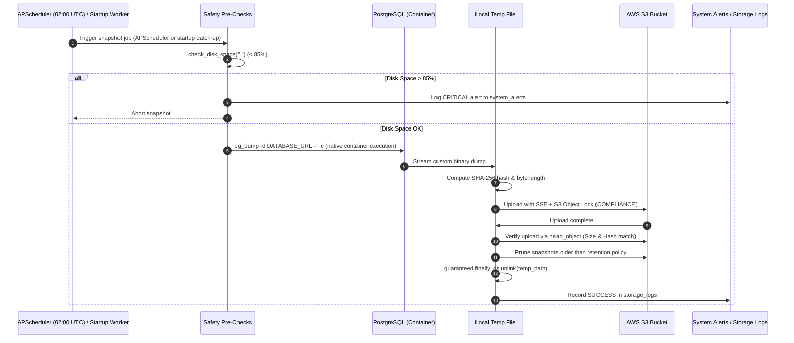

# Operations Guide: Automated Backup, WORM Retention & Disaster Recovery

This operational document outlines the technical mechanisms for automated database backups, safety checks, retention pruning, and emergency recovery procedures.

---

## 🕒 Automated Snapshot Pipeline (`backend/backup.py`)

The automated backup job runs daily at **02:00 AM UTC** via APScheduler, and also features **Automated Startup Catch-Up**:

* **Catch-Up on Boot**: When running on a non-24/7 machine (e.g. user's laptop that was powered off or asleep overnight), FastAPI evaluates `storage_logs` 5 seconds after startup.
* If the latest successful snapshot is older than **20 hours** (or no backup exists), an asynchronous background snapshot triggers automatically without delaying UI availability.

---

## 🔒 WORM (Write Once, Read Many) & Retention Policy

1. **Object Lock Compliance**:
   * When uploading snapshots to `backups/postgres/`, the backup engine applies S3 Object Lock in `COMPLIANCE` mode with a retain-until date of 28 days.
   * If the S3 bucket does not have Object Lock enabled at creation, the client gracefully falls back to standard SSE write + IAM denial policy without crashing.
2. **7 Daily + 4 Weekly Retention Matrix**:
   * **Daily Snapshots:** Keeps all snapshots created in the last 7 calendar days.
   * **Weekly Snapshots:** Retains up to 4 Sunday snapshots between 7 and 28 days old.
   * **Automated Pruning:** Snapshots exceeding this retention window are purged automatically after each successful snapshot upload.
   * **Auditing:** Every pruned backup object generates a `PURGE_RETENTION` entry in `storage_logs`.

---

## 🛡️ Operational Safety Pre-Checks

* **Host Disk Space Check (`shutil.disk_usage`)**:
  * Before generating any database dump, host disk usage is calculated.
  * If usage exceeds `disk_space_threshold_percent` (default **85%**), the backup aborts immediately to protect host system stability and registers a persistent alert in `system_alerts`.
* **Container-Native `pg_dump` Execution**:
  * The backup pipeline utilizes the `pg_dump` binary installed directly inside the backend container, connecting across the internal bridge network (`postgresql://postgres:root@db:5432/postgres`).
  * If running on a host without internal network DNS, it falls back to `docker exec dms-postgres pg_dump`. No PostgreSQL tools are required on the host Windows machine.
* **Leak-Proof Unlinking**:
  * Temporary `.dump` files are managed via `tempfile.NamedTemporaryFile` and unlinked in a mandatory `finally` block, ensuring no temporary files leak onto the disk even on unhandled exceptions.

---

## 🚨 Emergency Disaster Recovery

For 2:00 AM outages, corrupted database volumes, or cloud restorations, follow the step-by-step instructions in the dedicated recovery runbook:

👉 **[RECOVERY.md](file:///d:/Projects/Document%20handler/RECOVERY.md)**

### Key Recovery Commands:
* **List available backups:**  
  `aws s3 ls s3://document-managerr/backups/postgres/`
* **Download snapshot:**  
  `aws s3 cp s3://document-managerr/backups/postgres/<SNAPSHOT>.dump .`
* **Restore into container:**  
  `Get-Content -Raw .\<SNAPSHOT>.dump | docker exec -i dms-postgres pg_restore -U postgres -d postgres --clean --if-exists`
